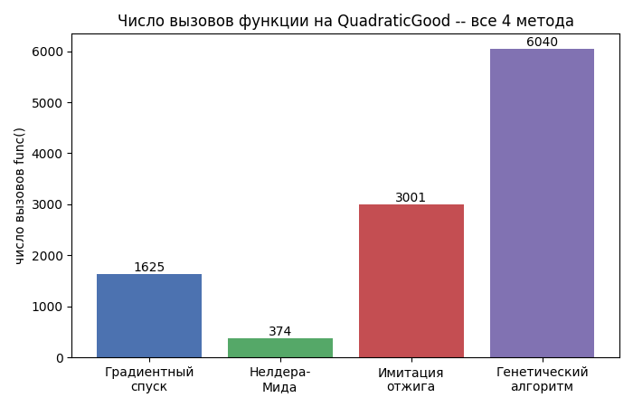
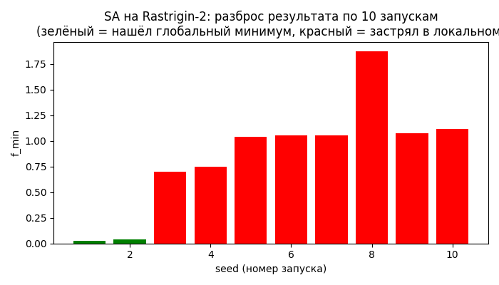
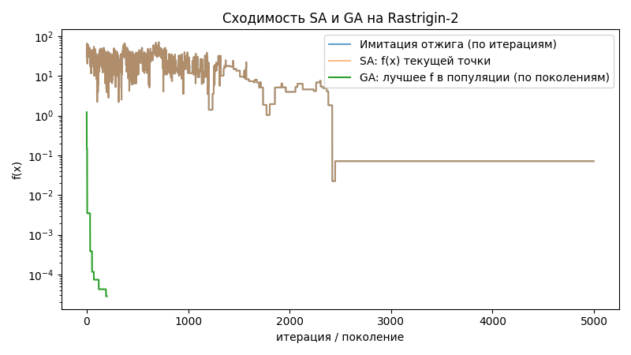

# Отчёт по лабораторной работе №2
### Продвинутые методы оптимизации

Реализованы два стохастических метода оптимизации (имитация отжига и
генетический алгоритм), не требующих непрерывности целевой функции.
Методы реализованы поверх типа `ConstructiveNumber` из лабы 1 -- для
этого дополнительно реализованы интервальные версии `cos`, `sin`, `exp`,
`sqrt`, `round`. Проведено сравнение с методами лабы 1 (градиентный
спуск, метод Нелдера-Мида) по скорости сходимости, числу вызовов
функции и требуемой памяти.

## Краткая документация по реализованным методам

### IntervalMath -- интервальные elementary-функции

Растригин, Экли и Desmos-функция используют `cos`, `sin`, `exp`, `sqrt`,
`round` -- в лабе 1 такие функции не требовались, поэтому пришлось
реализовать их интервальные версии:

- `exp`, `sqrt` -- монотонные, поэтому `f([a,b]) = [f(a), f(b)]`
- `cos`, `sin` -- **не монотонные**: нужно проверять, не попадает ли
  внутрь `[a,b]` точка экстремума (кратная `pi`); если попадает --
  результат включает экстремум (`1` или `-1`), иначе достаточно
  `min`/`max` от значений на границах
- `round` -- разрывная функция, интервальное расширение обязано быть
  **консервативным**: возвращает весь диапазон возможных округлений
  внутри `[a,b]`

### BlackBox2 -- три тестовые функции

| Функция | Гладкость | Сложность |
|---|---|---|
| `Rastrigin2` | гладкая | ~400 локальных минимумов на `[-5.12,5.12]^2` |
| `Ackley2` | гладкая | почти нулевой градиент на периферии |
| `Desmos` | **не гладкая** | разрывы из-за `round(...)`, градиент не определён |

Глобальный минимум всех трёх функций -- `f=0` в точке `(0,0)` (для
Desmos -- приближённо, локализовать труднее).

### Имитация отжига (Simulated Annealing)

На каждом шаге пробуется случайный "сосед" `y` в радиусе `delta`. Если
`y` лучше текущей точки -- переходим. Если хуже -- всё равно можем
перейти с вероятностью Метрополиса:
```
p(x, y, t) = exp((f(x) - f(y)) / t)
```
Температура `t` постепенно остывает (`t *= gamma` на каждой итерации).
Готовность иногда "ухудшиться" позволяет выбраться из локальных
минимумов.

### Генетический алгоритм

Держим популяцию точек. На каждом поколении:
1. **Отбор** -- турнирный (берём случайных `tournament_size` особей,
   оставляем лучшую)
2. **Скрещивание** -- новая особь = среднее двух случайных родителей
3. **Мутация** -- с вероятностью `mutation_rate` к каждой координате
   добавляется гауссов шум

## Исследования, проведённые в работе

### 1. Сравнение на функциях лабы 1 (гладкие)

| Функция | Метод | Итераций | func_calls | Время, с | Память | f_min |
|---|---|---|---|---|---|---|
| QuadraticGood | Градиентный спуск | 1625 | 1625 | 0.032 | 587 KB | 5.0e-13 |
| QuadraticGood | Нелдера-Мида | 230 | 374 | 0.013 | 56 KB | 4.8e-09 |
| QuadraticGood | Имитация отжига | 3000 | 3001 | 0.037 | 891 KB | 6.9e-02 |
| QuadraticGood | Генетический алгоритм | 150 | 6040 | 0.166 | 34 KB | 3.2e-04 |
| QuadraticBad | Градиентный спуск | 1536 | 1536 | 0.024 | 428 KB | 5.0e-13 |
| QuadraticBad | Нелдера-Мида | 158 | 269 | 0.007 | 29 KB | 1.3e-08 |
| QuadraticBad | Имитация отжига | 3000 | 3001 | 0.030 | 686 KB | 1.1e-01 |
| QuadraticBad | Генетический алгоритм | 150 | 6040 | 0.135 | 27 KB | 1.8e-04 |
| Rosenbrock | Градиентный спуск | 20000 | 20000 | -- | -- | 4.8e-09 |
| Rosenbrock | Нелдера-Мида | 223 | 392 | 0.007 | 35 KB | 3.3e-09 |
| Rosenbrock | Имитация отжига | 3000 | 3001 | 0.024 | 471 KB | 4.96e-01 |
| Rosenbrock | Генетический алгоритм | 150 | 6040 | 0.128 | 25 KB | 7.2e-01 |

**Вывод:** на гладких, "простых" функциях детерминированные методы
лабы 1 (особенно градиентный спуск) существенно точнее (`~1e-13` против
`~1e-1` у стохастических методов) при сопоставимом или меньшем числе
вызовов функции. Это ожидаемо -- градиентный спуск использует
дополнительную информацию (производную), которой стохастические методы
не пользуются.



### 2. Сравнение на функциях лабы 2 (Rastrigin-2, Ackley-2, Desmos)

Градиентный спуск здесь неприменим в принципе:
```
Градиентный спуск на Rastrigin2 -- ожидаемо не работает:
  NotImplementedError: Rastrigin-2: аналитический градиент не реализован
```

| Функция | Метод | Итераций | func_calls | f_min |
|---|---|---|---|---|
| Rastrigin-2 | Нелдера-Мида | 45 | ~90 | 4.97 |
| Rastrigin-2 | Имитация отжига | 5000 | 5001 | 0.022 |
| Rastrigin-2 | Генетический алгоритм | 200 | 8040 | 0.00003 |
| Ackley-2 | Нелдера-Мида | -- | -- | -- |
| Ackley-2 | Имитация отжига | 5000 | 5001 | 0.023 |
| Ackley-2 | Генетический алгоритм | 200 | 8040 | 0.00035 |
| Desmos | Нелдера-Мида | 133 | ~260 | 0.042 |
| Desmos | Имитация отжига | 5000 | 5001 | 26.6 |
| Desmos | Генетический алгоритм | 200 | 8040 | 0.00027 |

**Ключевое наблюдение:** метод Нелдера-Мида **мгновенно застревает** на
Растригине (45 итераций, далеко от глобального минимума) -- классическая
ловушка локального метода на мультимодальной функции с ~400 ямами.
Генетический алгоритм, напротив, стабильно находит глобальный минимум на
**всех трёх** функциях, включая недифференцируемую Desmos.

### 3. Устойчивость имитации отжига к случайности

Запустили имитацию отжига на Rastrigin-2 десять раз с разными `seed`:



Только **2 из 10** запусков (20%) нашли глобальный минимум -- остальные
застряли в одном из соседних локальных минимумов. Это -- принципиальная
особенность стохастических методов: результат не детерминирован и
существенно зависит от случайности.



## Теоретическое объяснение: почему GA превосходит SA на этих функциях

Имитация отжига исследует пространство **одной точкой** -- если эта
точка попадает в область притяжения локального минимума и температура
уже остыла, шанс выбраться оттуда падает. Генетический алгоритм
одновременно поддерживает **целую популяцию** точек -- даже если
большинство особей застревает в разных локальных минимумах, скрещивание
между разными "удачными" особями может дать потомка ближе к глобальному
минимуму. Это структурное преимущество популяционного поиска особенно
заметно на функциях с большим числом локальных минимумов (как
Растригин) -- SA имеет только один шанс "не застрять", GA -- сразу
несколько параллельных попыток.

С другой стороны, GA требует существенно больше вызовов функции на
итерацию (весь размер популяции), что видно и в таблицах, и на графике
сравнения -- это плата за более широкое исследование пространства.

## Основной вывод

Детерминированные методы лабы 1 эффективнее там, где применимы (гладкие
функции с известным градиентом или простой структурой) -- дают
существенно более точный результат при сопоставимых затратах.
Стохастические методы лабы 2 необходимы там, где детерминированные
неприменимы или ненадёжны: недифференцируемые функции (Desmos) и
функции с большим числом локальных минимумов (Растригин). Среди двух
стохастических методов генетический алгоритм оказался надёжнее
имитации отжига на всех трёх тестовых функциях -- ценой большего числа
вызовов функции на итерацию.
